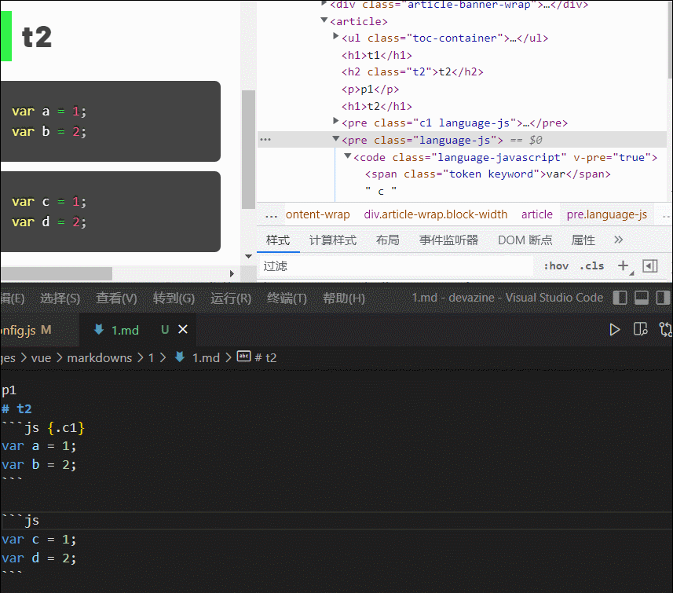

# vite-plugin-markdown-to-component

A plugin based on [vite-plugin-markdown](https://github.com/hmsk/vite-plugin-markdown) combines [markdown-it-attrs](https://github.com/arve0/markdown-it-attrs) & [KaTex](https://github.com/KaTeX) enables you to import a Markdown file as Vue component on your vite project.



## 1. Setup

```
npm i -D vite-plugin-markdown-to-component
```

## 2. Guidelines 

### Config

```js
// vite.config.js
/** commonjs **/
const mdPlugin = require('vite-plugin-markdown-to-component');
const options = {};

module.exports = {
  plugins: [mdPlugin(options)]
}

/** esm **/
import mdPlugin from 'vite-plugin-markdown-to-component'
module.exports = {
  plugins: [mdPlugin.plugin(options)]  // use mdPlugin.plugin API under esm mode
}
```

### Markdown File
All the code blocks will be processed by Prismjs.

> `[toc]` syntax is now optional supported as well. You sholud write `[toc]` on top as using this featrue.

> Btw, you can wrap certain blocks by `^^^` syntax, and use formula wrapped with `$$` (see example belows).

```md
[toc]
# t1
## t1-2 {.t2}

p1
# t2
ˋˋˋjs {.c1}
var a = 1;
var b = 2;
ˋˋˋ

^^^ {.wrapper-class}

> wrapped-block-1

wrapped-block-2

^^^

ˋˋˋjs {.c2 data-c=hello}
var c = 1;
var d = 2;
ˋˋˋ

$$KaTeX-formula^2$$

## t2-1
### t2-1-1
```

output:

```html
  <ul class="toc-container">
    <li class="level-1">t1</li>
    <li class="level-2">t1-2</li>
    <li class="level-1">t2</li>
    <li class="level-2">t2-1</li>
    <li class="level-3">t2-1-1</li>
  </ul>
  <h1>t1</h1>
  <h2 class="t2">t2</h2>
  <p>p1</p>
  <h1>t2</h1>
  <pre class="c1 language-js"><code class="language-js" v-pre="true"><span class="token keyword">var</span> a <span class="token operator">=</span> <span class="token number">1</span><span class="token punctuation">;</span>
  <span class="token keyword">var</span> b <span class="token operator">=</span> <span class="token number">2</span><span class="token punctuation">;</span>
  </code></pre>
  <div class="wrapper-class">
    <blockquote>
      <p>wrapped-block-1</p>
    </blockquote>
    <p>wrapped-block-2</p>
  </div>
  <pre class="c2 language-js" data-c="hello"><code class="language-js" v-pre="true"><span class="token keyword">var</span> c <span class="token operator">=</span> <span class="token number">1</span><span class="token punctuation">;</span>
  <span class="token keyword">var</span> d <span class="token operator">=</span> <span class="token number">2</span><span class="token punctuation">;</span>
  </code></pre>
  <p><span class="katex"><span class="katex-mathml"><math xmlns="http://www.w3.org/1998/Math/MathML"><semantics><mrow><mi>K</mi><mi>a</mi><mi>T</mi><mi>e</mi><mi>X</mi><mo>−</mo><mi>f</mi><mi>o</mi><mi>r</mi><mi>m</mi><mi>u</mi><mi>l</mi><msup><mi>a</mi><mn>2</mn></msup></mrow><annotation encoding="application/x-tex">KaTeX-formula^2</annotation></semantics></math></span><span class="katex-html" aria-hidden="true"><span class="base"><span class="strut" style="height:0.7667em;vertical-align:-0.0833em;"></span><span class="mord mathnormal" style="margin-right:0.07153em;">K</span><span class="mord mathnormal">a</span><span class="mord mathnormal" style="margin-right:0.13889em;">T</span><span class="mord mathnormal">e</span><span class="mord mathnormal" style="margin-right:0.07847em;">X</span><span class="mspace" style="margin-right:0.2222em;"></span><span class="mbin">−</span><span class="mspace" style="margin-right:0.2222em;"></span></span><span class="base"><span class="strut" style="height:1.0085em;vertical-align:-0.1944em;"></span><span class="mord mathnormal" style="margin-right:0.10764em;">f</span><span class="mord mathnormal" style="margin-right:0.02778em;">or</span><span class="mord mathnormal">m</span><span class="mord mathnormal">u</span><span class="mord mathnormal" style="margin-right:0.01968em;">l</span><span class="mord"><span class="mord mathnormal">a</span><span class="msupsub"><span class="vlist-t"><span class="vlist-r"><span class="vlist" style="height:0.8141em;"><span style="top:-3.063em;margin-right:0.05em;"><span class="pstrut" style="height:2.7em;"></span><span class="sizing reset-size6 size3 mtight"><span class="mord mtight">2</span></span></span></span></span></span></span></span></span></span></span></p>
  <h2>t2-1</h2>
  <h3>t2-1-1</h3>
```

### Single File Component

```js
<template>
  <VueComponent></VueComponent>
</template>

<script>
import VueComponent from './contents/the-doc.md';

export default {
  components: {
    VueComponent
  },
  setup() {
    return {
      toc: VueComponent.__toc
    }
  }
  // ...
}
</script>
```

### Others

use \`ˋ\` instead of \`\`\` to present a backquote inner `<code></code>`:


## 3. APIs

More details see [vite-plugin-markdown#options](https://github.com/hmsk/vite-plugin-markdown#options) and [https://github.com/arve0/markdown-it-attrs#usage](https://github.com/arve0/markdown-it-attrs#usage).

## License

MIT
